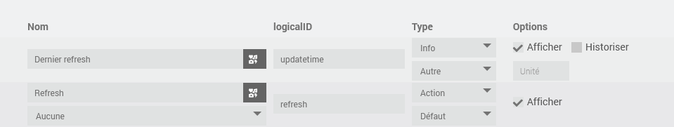

# Plugin OZW

Plugin permettant de s'interfacer avec les centrales de communication SIEMENS de type OZW. 

Les centrales de communication OZW sont utilisées pour communiquer avec les cartes pilotant de nombreuses chaudières, pompes à chaleur et autres dispositifs industriels. Celles-ci proposent un serveur WEB embarqué à partir duquel on peut piloter les dispositifs qui y sont connectés.

Il existe deux modèles au fonctionnement à peu près identique :

- OZW672 pour la communication avec les devices directement sur le bus LPB,BSB
- OZW772 pour la communication avec les devices via le protocole KNX

La communication entre le plugin et l'OZW s'effectue via les WEB APIs fournies par SIEMENS qui permettent de simuler les interactions réalisées normalement sur le serveur WEB.

Ce plugin est une évolution majeure du plugin OZW672 (voir https://github.com/NextDom/plugin-ozw672) qui n'est plus maintenu et ne fonctionne pas dans la version actuelle de Jeedom.

# Installation et configuration du controleur OZW

Pour l'installation de la centrale de communication WEB, se référer à la documentation SIEMENS correpondante.

Activer l'accès aux WEB APIs (menu Home > 0.5 OZWx72.01 > Settings > Communication > Services).

Le plugin a été testé avec une version 12 du WEB serveur. A priori, le plugin devrait fonctionner avec des versions antérieures car les appels aux APIs sont assez basiques et doivent exister depuis de nombreuses versions.

Une fois l'installation effectuée, on doit trouver une page WEB qui ressemble à ceci. 

Dans cette configuration, on trouve 2 devices:

-   le premier représente une carte LMS14 pilotant une chaudière
-   le second représente la centrale de communication OWZ672 et permet sa configuration

Les différents datapoints définis pour la carte sont accessibles. Il est possible de les consulter et éventuellement de les modifier.

Dans les APIs fournies par SIEMENS, les datapoints doivent être spécifiés via leur référence WEB que l'on peut trouver dans l'interface WEB.

Pour la trouver, se placer sur la ligne correspondante et lancer l'inspection de l'élément (en général Click-droit puis Inspecter). Dans le code correspondant, on trouve un numéro dans l'instruction 'openDialog('xxx') ' ou 'id='dpxxx' qui indique la référence WEB, 591 dans l'exemple ci-dessus.

De même, l'ID d'un menu peut être nécessaire et est touvée de la même façon, 590 dans l'exemple ci-dessus.

# Configuration du plugin

Une fois le plugin installé, il faut l'activer.

Vous pouvez activer le niveau de log Debug pour suivre l'activité du plugin et identifier les éventuels problèmes.

# Configuration des équipements

La configuration des équipements est accessible à partir du menu du plugin (menu Plugins, Objets Connectés puis OZW). 

Cliquer sur Ajouter pour définir l'OZW.

Indiquer la configuration de l'OZW :

-   **Nom** : nom de l'OZW
-   **Objet parent** : indique l’objet parent auquel appartient l’équipement
-   **Catégorie** : indique la catégorie Jeedom de l’équipement
-   **Activer** : permet de rendre l'équipement actif
-   **Visible** : le rend visible sur le dashboard
-   **Adresse IP** : IP de l’équipement
-   **Compte et mot de passe** : codes d'accès au WEB server
-   **Durée d'une session** : période après laquelle le session ID est renouvelé
-   **Icone** : permet de sélectionner un type d'icône pour l'équipement dans le paneau de configuration

Après avoir sauvegardé l'OZW, les boutons suivants sont actifs:

-   **Accéder à l'OZW** : permet d'ouvrir une session WEB sur l'OZW
-   **Importer les devices** :  permet d'importer les équipements correpondant aux devices attachés à l'OZW.

Dans l'exemple ci-dessus, on trouve après l'importation des devices :

- l'OZW672 en tant qu'équipement principal
- l'OZW672.01 en tant que device
- la carte LMS14 gérant la chaudière

Il est possible d'associer une icone spécifique au device. On peut également personaliser une icone de type perso en ajoutant l'image correspondante (par exemple perso1.png pour l'icone perso1) dans le répertoire plugin_info du plugin.

# Commandes associées aux équipements

Pour l'OZW, 2 commandes de type info sont créées :

- Etat : égal à 1 lorsque la communication est établie avec le WEB serveur, 0 dans le cas contraire
- SessionID : ID utilisé par les WEB APIs

Pour les devices attachés à l'OZW, 2 commandes sont créées :

- Dernier Refresh : commande de type info indiquant quand la dernière information du device a été mise à jour
- Refresh : commande de type action permettant de mettre à jour tous les datapoints pour lesquels l'update est activé

Le bouton 'Importer les commandes principales' dans l'onglet équipement permet d'importer tous les datapoints du menu appelé 'mobile'. Celui-ci est proposé dans l'application Android fournie par SIEMENS et n'est pas disponible pour tous les devices. La création des commandes peut prendre plusieurs minutes. Après exécution, on trouve les principaux datapoints du device définis comme des commandes de type info.

De même, le bouton 'Importer menu'  dans l'onglet équipement permet d'importer tous les datapoints d'un menu spécifique. Pour cela, il faut fournir la référence WEB du menu.

Dans l'onglet 'Commandes', les boutons suivants sont disponibles :

- Importer un datapoint : permet de créer une commande info pour un datapoint spécifique
- Ajouter une action : permet de modifier la valeur du datapoint (lorsque c'est permis dans le WEB serveur)
- Ajouter une commande refresh : permet de forcer la récupération de la valeur du datapoint

**Attention** : bien fournir la référence WEB du datapoint et non le numéro de ligne affiché sur la ligne du datapoint.

# Analyse des champs de la commande

Pour chaque commande relative à un datapoint, on trouve en plus des champs habituels de jeedom :

- le LogicalID: 
  - pour les commandes de type info, égal à la référence WEB du datapoint
  - pour les commandes action, égal à 'A_' suivi de la référence WEB du datapoint
  - pour les commandes refresh, égal à 'R_' suivi de la référence WEB du datapoint
- la coche update qui permet de demander ou non la mise à jour du datapoint
- le champ scan qui indique la fréquence de mise à jour du datapoint

# Widget

Voici un exemple de widget. On peut modifier le nom des commandes pour refléter le numéro de ligne indiqué dans le serveur WEB. 

